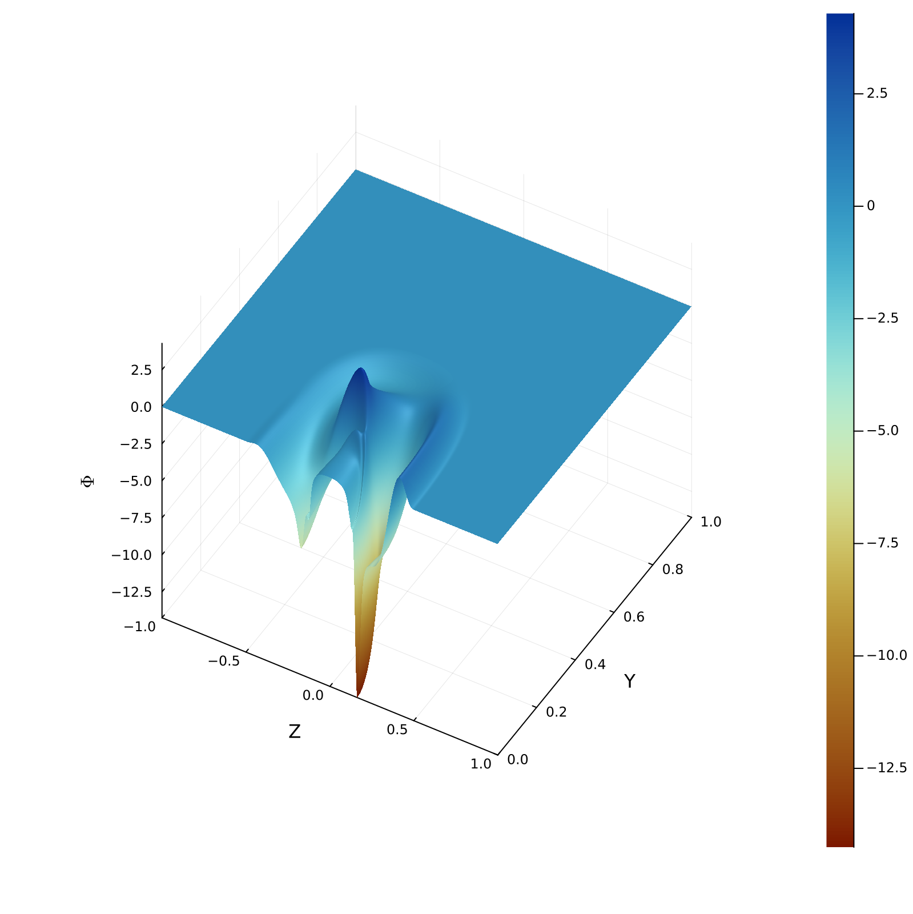

# **Evolution of the Non-Linear Wave Equation**

 

Author: Alejandro Cárdenas-Avendaño

This code implements a parallel solver for the non-linear wave equation for any general 3+1 dimensional static, spherically symmetric, and asymptotically flat (horizonless) spacetimes, as described in Ref [1]. The evolution is performed on a reduced 2+1 dimensional computational grid by leveraging axisymmetry, allowing for high spatial resolution with limited computational resources. The axisymmetry of both the solution and the background spacetime enables the use of the modified Cartoon method [2], an efficient approach to dimensional reduction.

The system evolves in time using the 4th-order Runge-Kutta (RK4) method, while spatial derivatives are computed using 4th-order finite differences. The code is flexible, supporting different spacetime metrics and initial conditions (ICs), making it adaptable for various scenarios.

We request that modifications or extensions leading to a scientific publication be made public as free software. 

 <em>Feel free to use images and movies produced with this code (with attribution) for your next presentation! </em> 

_______

_______

## **Dependencies**

The following Julia packages are used:

- **HDF5**: For writing output data in HDF5 format.
- **DelimitedFiles**: For reading and writing delimited text files.
- **ArgParse**: For command-line argument parsing.
- **GSL**: For GNU Scientific Library bindings.

To run the script, users can use the following command in the Julia REPL or terminal:

`julia Dependencies.jl`

## **Example Usage**

To run the simulation with a grid resolution of 0.002 (resulting on a grid of size 501 x 1001), initial time 0, final time 1, using 8 threads:

`julia --threads 8 simulation.jl --res=0.002 --ti=0.0 --tf=1.0`

On an Apple M2 Max, this evolution took about 3 minutes to complete, and each snapshot has a size of ~8MB. 

You can use visualize the results as shown in

<em>Visualization.ipynb</em>

Here is an example snapshot of the (trapped) field at t=0.5:

## **Main Functionality**

- Time evolution of the system using RK4.
- Fourth-order finite difference (FD) methods for spatial derivatives.
- Custom initial conditions and metrics (any general four-dimensional static, spherically symmetric, and asymptotically flat (horizonless) spacetimes).
- Aymptotically flat boundary conditions.
- Data output to HDF5 format for post-processing.

## **Code Structure**

The code includes four main components, each imported at the start:
1. **4dCartoonwave.jl**: Core wave equation solver.
2. **IC.jl**: Generates initial conditions for the wave equation.
3. **DOperators.jl**: Contains finite difference derivative operators.
4. **evolution.jl**: Handles the time evolution of the system using RK4.

### **Command-Line Arguments**
The script parses several command-line arguments using the `ArgParse` package. These parameters allow users to customize the simulation:

| Argument     | Description                                        | Type     | Default Value |
|--------------|----------------------------------------------------|----------|---------------|
| `--res`      | Resolution of the spatial grid (dy, dz)            | Float64  | 0.01          |
| `--ti`       | Initial time                                       | Float64  | 0.0           |
| `--tf`       | Final time                                         | Float64  | 1.0           |
| `--energb`   | Fraction of the grid for measuring energy          | Float64  | 0.95          |
| `--amp`      | Amplitude of the wave                              | Float64  | 4000.0        |

### **Key Constants and Parameters**

- **Courant Factor (`lambda`)**: Controls the time step based on spatial resolution.
- **Kreiss–Oliger Dissipation (`epsKO`)**: Applied for stability in the numerical scheme.
- **Grid Bounds (`ymin`, `ymax`, `zmin`, `zmax`)**: Define the spatial domain.
- **Time and Space Resolution**:
  - `dy`, `dz`: Spatial step size (set by `--res`).
  - `dt`: Time step, determined by the Courant condition (`lambda`).

### **Initial Conditions and Metric**
The script supports different spacetime metrics:
- **Minkowski** spacetime 
- **General** spacetime (an four-dimensional static, spherically symmetric, and asymptotically flat (horizonless) spacetimes). It currently is parametrized with metric potentials: `a = 0.026`, `b = 11.20`.

The `ICs!` function initializes the scalar field `phi` and momentum `pi`, along with the metric components and their derivatives.

### **Memory Allocation**
The code allocates memory for key arrays representing the scalar field, its derivatives, and the metric:
- Scalar field and its time/momentum derivatives: `phi_M1`, `pi_M1`, etc.
- Spatial derivatives: `phidx_M`, `phidy_M`, `phidz_M`, etc.
- Metric components: `gtt`, `gxx`, `gyy`, `gzz`, etc.
- Metric derivatives: `gtt_dx`, `gxx_dx`, `gyy_dx`, etc.

### **Simulation Time-Stepping**
The function `simulation!` evolves the wave equation using the allocated arrays, RK4 method, and the specified grid resolution.

### **Output**
The code generates two main outputs:
1. **Simulation parameters**: Stored in a `.txt` file (`Info_4DWave_*.txt`).
2. **Simulation data**: Stored in an HDF5 file (`Max_4DWave_*.h5`). This file contains time steps and maximum values of the scalar field and derivatives (e.g., `pidotmaxs`, `phidthdthmaxs`).

Both files are stored in the `Results` folder, which is created automatically if it doesn't already exist.

### **References**

[1] G. Benomio, A. Cardenas-Avendano, F. Pretorius, and A. Sullivan, On turbulence for spacetimes with stable trapping. [arXiv:24XXX](https://arxiv.org/abs/gr-qc/XXXX)

[2] F. Pretorius, Numerical relativity using a generalized harmonic decomposition, Class. Quant.
Grav. 22, 425 (2005), [arXiv:0407110](https://arxiv.org/abs/gr-qc/0407110)
